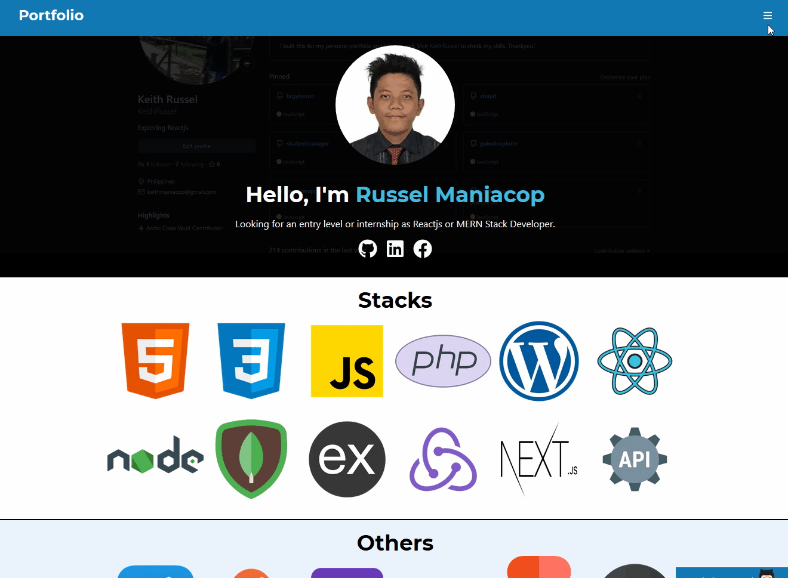

<h1 align="center">Hi there, I’m Russel Maniacop 👋:technologist: </h1> 

## About me
- 📖 I’m currently taking a Front-End Engineer career path program in Codecademy Pro.
- :keyboard: I'm a coding hobbyist who spends 5-9hrs coding for fun and studying Web Development in general.
- :sparkles: Interests:
  - :chess_pawn: I like playing Chess and Valorant
  - :tv: I am more have interest watching Korean series than other TV series
  - :beer: I like having a drink on beach with friends

## Top sample functional projects so far
- Student Manager - [Repo](https://github.com/KeithRussel/studentmanager) | [Live](https://intense-depths-40828.herokuapp.com)
- ShopIt Ecommerce - [Repo](https://github.com/KeithRussel/shopit) | [Live](https://shopitapp.herokuapp.com)
- Personal Portfolio Site with Blog CMS - [Repo](https://github.com/KeithRussel/keithrussel) | [Live](https://keithrussel.vercel.app/)
- Socially | Simple social crud & authentication function - [Repo](https://github.com/KeithRussel/socially-app) | Still Work In Progress..

  

    <h2>Exercises/Challenges</h2>
  

  
  ### Projects/Challenges
  - [Number Guesser](https://github.com/KeithRussel/Frontend-Engineering-Path/tree/main/VanillaJavascript/01-NumberGuesser)
  - [Film Finder](https://keithrussel.github.io/Frontend-Engineering-Path/JavascriptnReact/05-FilmFinder/)
  - [Authorization Form](https://codepen.io/keiiiiithh/pen/ExEXpQv)
  - [Playlistapp](http://russel-jammming.surge.sh/)
  - [Passing Thoughts](http://russel-passingthoughts.surge.sh)
  - [CopyCat](http://russel-copycat.surge.sh/)
  - [Pet Adoption](https://russel-routing-petadoption.netlify.app)
  - [Passing Thoughts](http://russel-passingthoughts.surge.sh)
  - [Appointment Planner](https://simpleappointmentplanner.netlify.app/)
  - [Matching Memory](https://redux-matching-memory.netlify.app)
  
  ### Gists of Some Lessons
  - [Redux Road](https://gist.github.com/codecademydev/1cf8a159d792aad426fb3b5da9396d1c)
  - [Redux Lights on/off](https://gist.github.com/427ca53e2ec2fb2e9c0d8ace8c54697a)
  - [Redux Strategies for Complex State (Recipes App)](https://gist.github.com/codecademydev/35bfdf9acd8370193d93c43d66986e73)
  - [Redux Codecademy Store](https://gist.github.com/codecademydev/51aba28c7326151708fb333d12d43dce)
  - [React-Redux Library(Recipe App)](https://gist.github.com/codecademydev/4534eb9a35b44228e4de3a23ebf079c7)
  - [Refactoring with Redux Toolkit(Expense Tracker)](https://gist.github.com/codecademydev/482336f1b12e542dc7b977e5d8d17c90)
  - [createAsyncThunk comparison old vs with createAsyncThunk](https://gist.github.com/cbcfbfae923391902499ed6b75d418ca)
  
  ### Other Exercises Link
  - [Codepen](https://codepen.io/keiiiiithh)

## Skills

  
  
  
  
  
  
  
  
  
  
  
  

  

    <h2>Learning path</h2>
  

  
  ### Current courses
  - [Codecademy | Front-End Engineer Career Path](https://www.codecademy.com/learn/paths/front-end-engineer-career-path) | 64% progress at the moment
  
  ### Future courses
  - [Codecademy | Full Stack Engineer Career Path](https://www.codecademy.com/learn/paths/full-stack-engineer-career-path)
  - [Data Scientist | Machine Learning](https://www.codecademy.com/learn/paths/data-science)

  

    <h2>Useful infos and contents</h2>
  

  ### Accessibility
  - [HTML Elements](https://developer.mozilla.org/en-US/docs/Web/HTML/Element)
  - [WAI/ARIA in HTML](https://w3c.github.io/using-aria/#intro)
  - [The a11y Project Checklist](https://www.a11yproject.com/checklist/)
  - [CSS and JavaScript accessibility best practices](https://developer.mozilla.org/en-US/docs/Learn/Accessibility/CSS_and_JavaScript#css_and_javascript_are_accessible)
  - [Complete list of ARIA Properties](https://developer.mozilla.org/en-US/docs/Web/Accessibility/ARIA/ARIA_Techniques)
  - [Flat Design Article](https://www.nngroup.com/articles/flat-design/)
  
  ### CSS ANIMATIONS
  - [Animatable CSS Properties](https://developer.mozilla.org/en-US/docs/Web/CSS/CSS_animated_properties)
  - [Timing Functions](https://developer.mozilla.org/en-US/docs/Web/CSS/transition-timing-function)
  - [CSS Transitions documentation](https://developer.mozilla.org/en-US/docs/Web/CSS/CSS_Transitions/Using_CSS_transitions)
  - [CSS Transforms documentation](https://developer.mozilla.org/en-US/docs/Web/CSS/CSS_Transforms/Using_CSS_transforms)
  - [CSS Animation for beginners](https://thoughtbot.com/blog/css-animation-for-beginners)
  - [MDN CSS Animations](https://developer.mozilla.org/en-US/docs/Web/CSS/CSS_Animations/Using_CSS_animations)
  - [Keyframes](https://keyframes.app/)
  - [Animasta](https://animista.net/)
  
  ### GIT and Markdown
  - [Version Control in VSCode](https://code.visualstudio.com/docs/introvideos/versioncontrol)
  - [Git Docs](https://git-scm.com/docs/git)
  - [Github Docs](https://docs.github.com/en)
  - [Git Cheat Sheet](https://education.github.com/git-cheat-sheet-education.pdf)
  - [Github Guide to Markdown](https://docs.github.com/en/get-started/writing-on-github/getting-started-with-writing-and-formatting-on-github/basic-writing-and-formatting-syntax)
  - [Markdown Parsers Dillinger](https://dillinger.io/)
  
  ### Javascript I. Classes and Modules
  - [Javascript Classes](https://developer.mozilla.org/en-US/docs/Web/JavaScript/Reference/Classes)
  - [Design Patterns](https://www.patterns.dev/)
  - [Javascript Modules](https://developer.mozilla.org/en-US/docs/Web/JavaScript/Guide/Modules)
  - [Understanding Classes in JS](https://www.taniarascia.com/understanding-classes-in-javascript/)
  - [Prototypes and Inheretance in JS](https://www.digitalocean.com/community/tutorials/understanding-prototypes-and-inheritance-in-javascript)
  - [Inheretance and Protochain](https://developer.mozilla.org/en-US/docs/Web/JavaScript/Inheritance_and_the_prototype_chain)
  
  ### Javascript Testing
  - [Assert Nodejs](https://nodejs.org/api/assert.html)
  - [Assert.deepEqual](https://nodejs.org/api/assert.html#assert_assert_deepequal_actual_expected_message)
  - [Other Assert Method](https://nodejs.org/api/assert.html)
  - [Characteristics of Good Test](https://www.codecademy.com/article/tdd-u1-good-test)
  - [Introduction to TDD - Test Driven Development](https://hackernoon.com/introduction-to-test-driven-development-tdd-61a13bc92d92)
  - [MochaJS](https://mochajs.org/#getting-started)
  - [ChaiJS](https://www.chaijs.com/guide/styles/)
  - [SinonJS](https://sinonjs.org/releases/latest/spies/)
  - [EnzymeJS](https://enzymejs.github.io/enzyme/)
  - [JEST](https://jestjs.io/docs/tutorial-react)
  
  ### Async Javascript and HTTP Requests
  - [AJAX](https://developer.mozilla.org/en-US/docs/Web/Guide/AJAX)
  - [What the heck is the Event Loop](https://www.youtube.com/watch?v=8aGhZQkoFbQ&ab_channel=JSConf)
  - [Guide to Graceful asynchronous Programming with Promises](https://developer.mozilla.org/en-US/docs/Learn/JavaScript/Asynchronous/Promises)
  - [Introduction to Web API](https://developer.mozilla.org/en-US/docs/Learn/JavaScript/Client-side_web_APIs/Introduction)
  - [Overview to HTTP](https://developer.mozilla.org/en-US/docs/Web/HTTP/Overview)
  - [MDN: Using Fetch API](https://developer.mozilla.org/en-US/docs/Web/API/Fetch_API/Using_Fetch)
  - [MDN: Guide to Third Party API](https://developer.mozilla.org/en-US/docs/Learn/JavaScript/Client-side_web_APIs/Third_party_APIs)
  
  ### Web Apps
  - [Poll Results: Sites vs Apps](https://css-tricks.com/poll-results-sites-vs-apps/)
  - [Javascript Refresher](https://developer.mozilla.org/en-US/docs/Web/JavaScript/A_re-introduction_to_JavaScript#overview)
  - [Intro to Functional Javascript](https://medium.com/functional-javascript/introduction-to-functional-javascript-45a9dca6c64a)
  - [Destructuring Assignment](https://developer.mozilla.org/en-US/docs/Web/JavaScript/Reference/Operators/Destructuring_assignment)
  - [Difference between DOM vs Virtual DOM](https://reactkungfu.com/2015/10/the-difference-between-virtual-dom-and-dom/)
  
  ### React Part I
  - [Gentle Explaination of "this" in Javascript](https://dmitripavlutin.com/gentle-explanation-of-this-in-javascript/)
  - [Create React App](https://create-react-app.dev/docs/getting-started)
  - [React Docu](https://reactjs.org/docs/getting-started.html)
  - [Thinking in React](https://reactjs.org/docs/thinking-in-react.html)
  - [What the fork is React Virtual DOM](https://maggieappleton.com/react-vdom)
  - [Awesome React](https://github.com/enaqx/awesome-react)
  
  ### React Part II
  - [React Handling Events](https://reactjs.org/docs/handling-events.html)
  - [React Dev Tools Sandbox](https://react-devtools-tutorial.vercel.app/element-selector-tool)
  - [Component Lifecycle Diagram](https://projects.wojtekmaj.pl/react-lifecycle-methods-diagram/)
  - [State and Lifecycle](https://reactjs.org/docs/state-and-lifecycle.html)
  - [React Component](https://reactjs.org/docs/react-component.html)
  - [Awesome React](https://github.com/enaqx/awesome-react)
  
  ### Intermediate React
  - [Container Components](https://medium.com/@learnreact/container-components-c0e67432e005)
  - [Presentational and Container Components](https://medium.com/@dan_abramov/smart-and-dumb-components-7ca2f9a7c7d0)
  - [Gist Presentational & Container Components II](https://gist.github.com/chantastic/fc9e3853464dffdb1e3c)
  
  ### React Debug & Testing
  - [Debugging React](https://code.visualstudio.com/docs/nodejs/reactjs-tutorial#_debugging-react)
  - [React Jest Enzyme](https://pusher.com/tutorials/react-jest-enzyme/)
  - [Advance React Components mocks with Jest and React testing library](https://ericdcobb.medium.com/advanced-react-component-mocks-with-jest-and-react-testing-library-f1ae8838400b)
  - [Testing in React best practices tips and tricks](https://techblog.commercetools.com/testing-in-react-best-practices-tips-and-tricks-577bb98845cd)
  

  

    <h2>GitHub stats</h2>
  

  

  
  

  

# Personal Portfolio and Custom CMS Blog Site

Im new to NEXTJS a javascript framework and I found it interesting. To explore about it I decided to build this PWA to make my personal portfolio blog site and will keep updating it to add some features. [sample link](https://keithrussel.vercel.app/)

## Features

- Showcase my portfolio & skill excercises
- Can Post Blog using Ghost CMS backend
- Contact Form

## Tech Used

- HTML, CSS3 & JS
- Nextjs
- Reactjs
- Headless Ghost CMS backend (free for development purpose)
- Fontawesome icons
- Nodemailer + googleapi OAuth2
